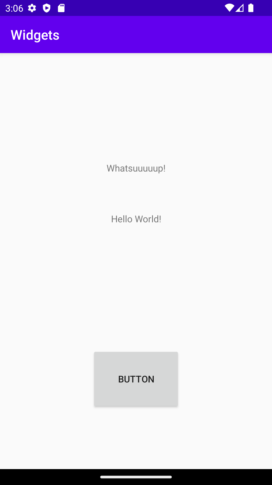

# Rapport

Skapade en constraint layout och sedan implementerades 2 st textviews 1 imageview och 1 button.
Ändrade positionen på widgets och contraints för dessa implementerades.

Nedan i Screenshot 1 kan man se hur layouten ser ut i emulatorn.

Screenshot 1

Nedan kan man se hur koden på constraints ser ut till Button widgeten som har skapats.
app:layout_constraintBottom_toBottomOf="parent"
app:layout_constraintEnd_toEndOf="parent"
app:layout_constraintStart_toStartOf="parent"
app:layout_constraintTop_toBottomOf="@+id/textView3" 